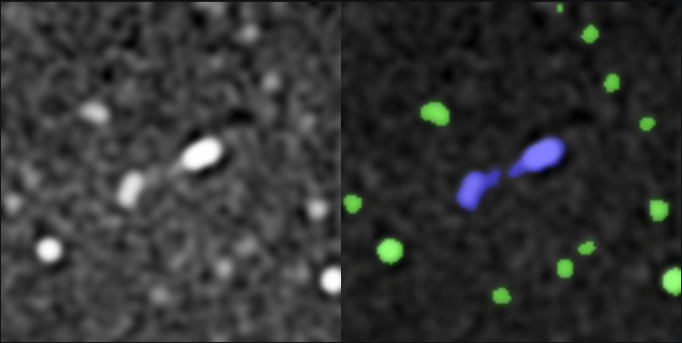

<div align="center">    
 
# Radio Tiramisu
Semantic segmentation of radio maps with the [Tiramisu](https://github.com/0bserver07/One-Hundred-Layers-Tiramisu) model.

[](https://huggingface.co/spaces/rsortino/radio-tiramisu)
[](https://link.springer.com/chapter/10.1007/978-3-030-89691-1_38)
<div align=center></div>

<div align="left">    
 
## Usage

### Training
Train the model on your FITS data by running the `train.py` script. The list of image paths needs to be specified by a text file where each line is a **relative** image path and the root data folder from which to look for files. 

```bash
python train.py --dataset {PATH_TO_TXT_FILE} --data_dir {PATH_TO_DATA_DIR} --resume {PRETRAINED_WEIGHTS} --n_classes {N_CLASSES} --run-name {RUN_NAME} 
```

### Inference
To perform inference, run the [streamlit](https://streamlit.io/) file by running 
```bash
python run app.py
```
